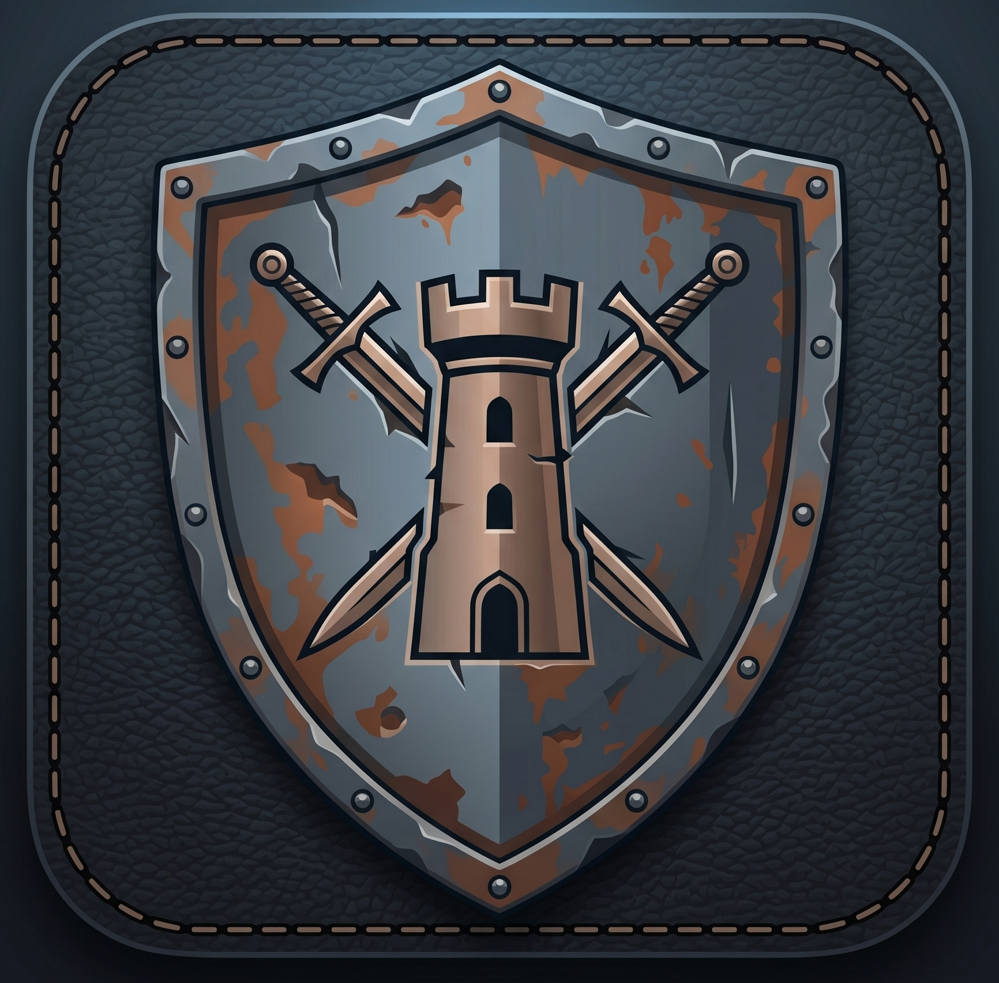

# ⚔️ Gloom Tracker

**A powerful, offline-first Gloomhaven Combat Assistant — built as a Progressive Web App.**

Track initiative order, HP, status conditions, elemental infusions, and scenario encounters for your Gloomhaven campaigns. Designed for fast, intuitive play on mobile devices.



---

## Features

- **Initiative Tracking** — Input and resolve initiatives for all players and monster groups each round. Automatic tie-breaking support.
- **HP Management** — Quick ±1/±3/±5 HP buttons with a visual HP bar. Tracks both normal and elite standees.
- **Status Conditions** — Apply and remove Gloomhaven conditions (Poison, Wound, Stun, Muddle, etc.) with emoji indicators.
- **Element Infusion** — Track all 6 elements (Fire, Ice, Wind, Earth, Light, Dark) with waning state.
- **Scenario Templates** — Pre-built monster encounter templates from official Gloomhaven scenarios, auto-scaled to player count.
- **Monster Scaling** — Monster stats automatically scale to the selected scenario level (0–7).
- **Spawn & Summon** — Spawn additional monsters mid-combat, or summon allied creatures during a player's turn.
- **Progressive Web App** — Install to your home screen and play fully offline, no internet required.

---

## Screenshots

> *Mobile-first dark UI with glassmorphism design.*

---

## Tech Stack

| Layer | Technology |
|---|---|
| Framework | [React 19](https://react.dev/) + [Vite 8](https://vite.dev/) |
| Styling | [Tailwind CSS v4](https://tailwindcss.com/) |
| State | [Zustand](https://zustand-demo.pmnd.rs/) |
| Animation | [Framer Motion](https://www.framer.com/motion/) |
| Icons | [Lucide React](https://lucide.dev/) |
| PWA | [vite-plugin-pwa](https://vite-pwa-org.netlify.app/) + Workbox |

---

## Getting Started

### Prerequisites

- Node.js 18+
- npm 9+

### Install & Run

```bash
# Clone the repository
git clone https://github.com/Acron3/gloom-tracker.git
cd gloom-tracker

# Install dependencies
npm install

# Start development server
npm run dev
```

Open [http://localhost:5173](http://localhost:5173) in your browser.

### Build for Production

```bash
npm run build
npm run preview
```

The production build includes the full PWA service worker and offline caching.

---

## PWA Installation

### Android / Desktop (Chrome, Edge)
An **Install** banner will appear at the bottom of the Setup screen. Tap it to install directly.

### iOS (Safari)
Tap the **How to** button in the install banner for step-by-step instructions:
1. Tap the **Share** button in Safari
2. Scroll down and tap **Add to Home Screen**
3. Tap **Add**

---

## Data & Customization

### Scenarios
Edit `src/data/scenarios.json` to add more scenario templates. Each scenario defines monster groups with count scaling per player count (2–4 players).

### Monsters
Edit `src/data/monsters.json` to add monsters. Each entry includes:
- HP, Move, Attack, Range stats for levels 0–7 (normal & elite)
- A `lucide-react` icon key for display

### Characters
Edit `src/data/characters.json` to add character classes with HP progressions and emoji icons.

### Statuses
Edit `src/data/statuses.json` to customize status conditions with name, emoji icon, type (harmful/beneficial), and description.

---

## Project Structure

```
src/
├── components/
│   ├── ActiveTurnPanel.jsx   # Detailed entity panel (HP, conditions, actions)
│   ├── ComboBox.jsx          # Searchable dropdown component
│   ├── ElementBar.jsx        # Element infusion tracker
│   ├── EntityCard.jsx        # Initiative queue card
│   ├── HPTracker.jsx         # HP bar + modifier buttons
│   ├── InitiativeQueue.jsx   # Sorted turn order list
│   ├── MonsterIcon.jsx       # Lucide icon resolver for monsters
│   ├── PWAInstallBanner.jsx  # PWA install prompt UI
│   ├── SpawnModal.jsx        # Mid-combat monster spawning
│   ├── StatusApplyModal.jsx  # Status condition picker
│   ├── StatusPanel.jsx       # Active conditions display
│   └── SummonModal.jsx       # Player summon creation
├── data/
│   ├── characters.json       # 24 Gloomhaven character classes
│   ├── elements.json         # 6 elemental infusions
│   ├── monsters.json         # 36 monsters with full stats (levels 0–7)
│   ├── scenarios.json        # Scenario encounter templates
│   └── statuses.json         # Status condition definitions
├── hooks/
│   └── usePWAInstall.js      # PWA install prompt hook
├── pages/
│   ├── Combat.jsx            # Combat screen (initiative + active turn)
│   └── Setup.jsx             # Campaign setup screen
└── store/
    └── gameStore.js          # Zustand global state
```

---

## License

MIT — feel free to use, modify, and share.

---

> *Gloom Tracker is an unofficial companion app and is not affiliated with Cephalofair Games or the Gloomhaven brand.*
